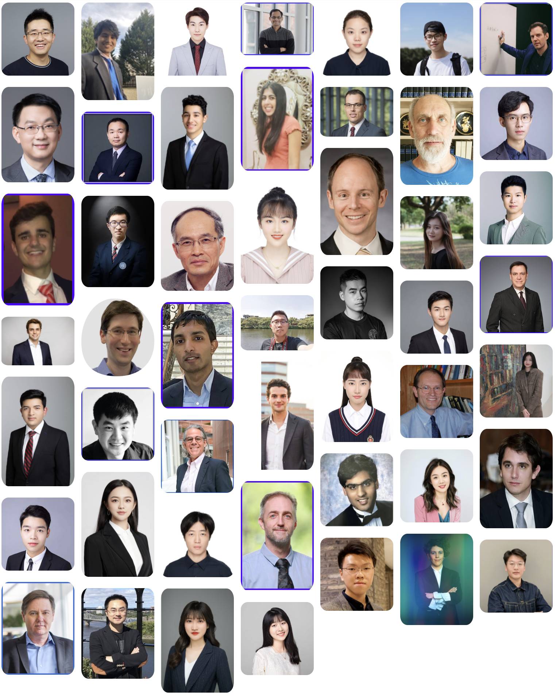

# About Us

## Inaugural E-Board

!!! quote "Motto in light of eastern and western philosophy"
    Aristotle and Plato: form or matter? 

    “君子不器”—《论语·为政》

    <figure>
        <figurecaption>Prof. Luyao Zhang</figurecaption>
    </figure>
    <figure>
        <figurecaption>Prof. Yulin Liu</figurecaption>
    </figure>
    <figure>
        <figurecaption>Ray Zhu</figurecaption>
    </figure>
    <figure>
        <figurecaption>Xinyu Tian</figurecaption>
    </figure>
    <figure>
        <figurecaption>Tianyu Wu</figurecaption>
    </figure>
    <figure>
        <figurecaption>Yixuan Li</figurecaption>
    </figure>
    <figure>
        <figurecaption>Ziliang Tian</figurecaption>
    </figure>
    <figure>
        <figurecaption>Zesen Zhuang</figurecaption>
    </figure>
    <figure>
        <figurecaption>Zichao Chen</figurecaption>
    </figure>
    <figure>
        <figurecaption>Yufan Zhang</figurecaption>
    </figure>

<!-- Modals -->

  <!-- The Close Button -->
  &times;

  <!-- Modal Content (The Image) -->
  

<!-- Modals -->

  <!-- The Close Button -->
  &times;

  <!-- Modal Content (The Image) -->
  

<!-- Modals -->

  <!-- The Close Button -->
  &times;

  <!-- Modal Content (The Image) -->
  

<!-- Modals -->

  <!-- The Close Button -->
  &times;

  <!-- Modal Content (The Image) -->
  

<!-- Modals -->

  <!-- The Close Button -->
  &times;

  <!-- Modal Content (The Image) -->
  

<!-- Modals -->

  <!-- The Close Button -->
  &times;

  <!-- Modal Content (The Image) -->
  

<!-- Modals -->

  <!-- The Close Button -->
  &times;

  <!-- Modal Content (The Image) -->
  

<!-- Modals -->

  <!-- The Close Button -->
  &times;

  <!-- Modal Content (The Image) -->
  

<!-- Modals -->

  <!-- The Close Button -->

  <!-- Modal Content (The Image) -->
  
  &times;

<!-- Modals -->

  <!-- The Close Button -->

  <!-- Modal Content (The Image) -->
  
  &times;

 

## People

### SciEcon Operation

#### Founders and Supervisors

---

**Name**: Luyao Zhang | 张露瑶

**Title**: Founding President

**LinkedIn**: [https://www.linkedin.com/in/sunshineluyao/](https://www.linkedin.com/in/sunshineluyao/)

**Personal Website**: [http://scholars.duke.edu/person/luyao.zhang](http://scholars.duke.edu/person/luyao.zhang)

**Twitter**: [https://twitter.com/sunshineluyao](https://twitter.com/sunshineluyao)

**Facebook**: [https://www.facebook.com/sunshinestar11](https://www.facebook.com/sunshinestar11)

!!! quote "Motto in light of eastern and western philosophy"
    Dao dejing:The Dao produced One; One produced Two; Two produced Three; Three produced All things.

    道德經: 道生一，一生二，二生三，三生萬物。

    Spinoza: Passion without reason is blind; Reason without passion is dead.

    斯宾诺莎: 天人合一，道法自然

---

**Name**: Yulin Liu | 刘玉林

**Title**: Founding President

**LinkedIn**: [https://www.linkedin.com/in/yulineth/](https://www.linkedin.com/in/yulineth/)

**Twitter**: [https://twitter.com/YulinLiu20](https://twitter.com/YulinLiu20)

**Personal Website**: [https://www.yulinliu.me/](https://www.yulinliu.me/)

!!! quote "Motto in light of eastern and western philosophy"
    
    “上善若水，水利万物而不争” —《道德经》
    
    The noblest virtue is like water, which nourishes all things without contending with them. 

    “日往则月来，月往则日来，日月相推而明生焉” —《易·系辞》
    
    The sun rises while the moon sets. The moon rises while the sun sets. Brightness derives from day’s and night’s deduction.

#### Inaugural E-Board

---

**Name**: Ray Zhu | 朱家昇

**Title**: Interim Chair of Incubation and Investment Research

**LinkedIn**: [https://www.linkedin.com/in/jiasheng-ray-zhu-845241177/](https://www.linkedin.com/in/jiasheng-ray-zhu-845241177/)

!!! quote "Motto in light of eastern and western philosophy"
    Mencius: A just cause attracts much support, an unjust one finds little.

    得道多助，失道寡助。

---

**Name**: Xinyu Tian | 田馨宇

**Title**: Interim Chair of Communication

**LinkedIn**: [https://www.linkedin.com/in/xinyu-tian-1777aa203/](https://www.linkedin.com/in/xinyu-tian-1777aa203/)

!!! quote "Motto in light of eastern and western philosophy"
    读万卷书，行万里路。

    Read more, travel more.

---

**Name**: Tianyu Wu | 吴天语

**Title**: Interim Chair of Human Resources

**LinkedIn**: [https://www.linkedin.com/in/tianyu-henry-wu/](https://www.linkedin.com/in/tianyu-henry-wu/)

!!! quote "Motto in light of eastern and western philosophy"
    中文：博学之，审问之，慎思之，明辨之，笃行之。

    English: To learn extensively, to inquire accurately, to reflect carefully, to distinguish clearly, and to manifest earnestly.

    Deutsch: Lernen Sie es, hinterfragen Sie es, denken Sie sorgfältig darüber nach, unterscheiden Sie es klar und üben Sie es ernsthaft.

---

**Name**: Zesen Zhuang | 庄泽森

**Title**: Interim Chair of Technology Development

**LinkedIn**: [https://www.linkedin.com/in/zesen-zhuang-624591217/](https://www.linkedin.com/in/zesen-zhuang-624591217/)

**Personal Website**: [https://www.crinstaniev.com](https://www.crinstaniev.com)
in"

!!! quote "Motto in light of eastern and western philosophy"
    Preserve your dignity as a nobody; promote the social wellfare as a somebody.

    穷则独善其身，达则兼济天下

---

**Name**: Zichao Chen | 陈子超

**Title**: Interim Chair of Research Incubator

**LinkedIn**: [https://www.linkedin.com/in/zichao-9507281a9/](https://www.linkedin.com/in/zichao-9507281a9/)

!!! quote "Motto in light of eastern and western philosophy"
    Aristotle: The ultimate value of life depends upon awareness and the power of contemplation rather than upon mere survival. 

    亚里士多德：人生最终的价值在于觉醒和思考的能力，而不只在于生存。

---

**Name**: Yufan Zhang | 张宇凡

**Title**: Interim Chair of Creativity and Innovation

**LinkedIn**: [https://www.linkedin.com/in/helloyufan/](https://www.linkedin.com/in/helloyufan/)

!!! quote "Motto in light of eastern and western philosophy"
    The running water does not rot, and the pivot of the house does not stink.

    流水不腐，户枢不蠹。

#### Honour E-Boards

---

**Name**: Yixuan Li | 黎以萱

**Title**: Honour Chair of Creativity

**LinkedIn**: [https://www.linkedin.com/in/yixuan-li-269356192/](https://www.linkedin.com/in/yixuan-li-269356192/)

!!! quote "Motto in light of eastern and western philosophy"
    Live life. Learn lessons. Liberate yourself.

    生活。学习。解放自我。

---

**Name**: Ziliang (Lewis) Tian

**Title**: Honour Chair of Sustainability and Social Impact

**LinkedIn**: [https://www.linkedin.com/in/lewistian/](https://www.linkedin.com/in/lewistian/)

!!! quote "Motto in light of eastern and western philosophy"
    Seeking the best version of self

    寻找最好的自己

### SciEcon Program

#### SciEcon Affiliates

---

**Name**: Xinyu Tian | 田馨宇

**Title**: Research Affiliate; Innovation Affiliate; Philanthropist Affiliate

**LinkedIn**: [https://www.linkedin.com/in/xinyu-tian-1777aa203/](https://www.linkedin.com/in/xinyu-tian-1777aa203/)

---

**A Glance into the Metaverse, SciEcon-Insights-Research**

Authors: Xinyu Tian, Zesen Zhuang, Design: Austen Li, Executive Editor: Xinyu Tian, Chief Editor: Prof. Luyao Zhang

**[[Medium](https://medium.com/sciecon-research/a-glance-into-the-metaverse-80004e9e1d1)]**

**Algorithmic Trading in Crypto Market, SciEcon-Insights-Research**

Authors: Xinyu Tian, Tianyu Wu, Design: Austen Li, Chief Editor: Prof. Luyao Zhang

**[[Medium](https://medium.com/sciecon-research/algorithmic-trading-in-crypto-market-6e452aaa8ca2)]**

**The Future of Consensus: Algorithm on Blockchain, SciEcon-Insights-AMA**

Interviewee: Prof. Olivier Marin, Interviewer: Ray Zhu, Executive Editors: Zichao Chen, Xinyu Tian, ​​​​​​​​​​​​​​​​​​​​​Lunji Zhu, Chief Editor: Prof. Luyao Zhang

**[[Medium](https://medium.com/sciecon-ama/prof-olivier-marins-views-on-the-consensus-mechanism-of-blockchain-b6d8eb643d00)]**

**A Conversation on Cryptography, Trust Machine, and Cyber Planet Construction, SciEcon-Insights-AMA**

Interviewee: Prof. Kevin Mo, Interviewers: Tianyu Wu, Xinyu Tian, Prof. Luyao Zhang, Executive Editors: Tianyu Wu, Xinyu Tian, Chief Editor: Prof. Luyao Zhang

**[[Medium](https://medium.com/sciecon-ama/a-conversion-on-cryptography-trust-machine-and-cyber-planet-construction-579f2e0d8bfd)]**

**A Glance into Liquity, SciEcon-Insights-AMA**

Interviewee: Dr. Robert Lauko, Interviewers: Xinyu Tian, William Zhao, Executive Editors: William Zhao, Xinyu Tian, Chief Editors: Prof. Luyao Zhang and Prof. Yulin Liu

**[[Medium](https://medium.com/sciecon-ama/a-glance-into-liquity-fdde75f31fd0)]**

**On the Mechanics of Blockchain Security, SciEcon-Insights-AMA**

Interviewee: Prof. Fan Zhang, Interviewers: Prof. Luyao Zhang, Xinyu Tian, Zesen Zhuang, Chief Editor: Prof. Luyao Zhang

**[[Medium](https://medium.com/sciecon-ama/on-the-mechanics-of-blockchain-security-5375a7ea2c43)]**

**Tokeneconomics: When Macro and Micro Economics Unite in Finance, SciEcon-Insights-AMA**

Interviewee: Prof. Ye Li, Interviewers: Xinyu Tian, Zesen Zhuang, Executive Editors: Xinyu Tian, Zesen Zhuang, Chief Editor: Prof. Luyao Zhang

**[[Medium](https://medium.com/sciecon-ama/tokeneconomics-when-macro-and-micro-economics-unite-in-finance-97d8096c3ad4)]**

**WaterPark: A Decentralized Borrowing Protocol for the Internet Computer,** **SciEcon-Insights-AMA**

Interviewees: Rhys Banerjee, Oum Lahade, Interviewers: Xinyu Tian, Zesen Zhuang, Associate Editor: Lunji Zhu, Executive Editors: Xinyu Tian, Zesen Zhuang, Chief Editor: Prof. Luyao Zhang

**[[Medium](https://medium.com/sciecon-ama/waterpark-a-decentralized-borrowing-protocol-for-the-internet-computer-ce95940f5463)]**

**ICy: A Decentralized Lending Protocol on the Internet Computer, SciEcon-Insights-AMA**

Interviewees: Dylan Paul, Malika Rawal, Interviewers: Xinyu Tian, Zesen Zhuang, Associate Editor: Zichao Chen, Executive Editors: Xinyu Tian, Zesen Zhuang, Chief Editor: Prof. Luyao Zhang

**[[Medium](https://medium.com/sciecon-ama/icy-a-decentralized-lending-protocol-on-the-internet-computer-3b4eefb20313)]**

**Towards Decentralized Protocols: Call for Collaborations, SciEcon-Insights-AMA**

Interviewee: Derrick Adam, Interviewers: Xinyu Tian, Zesen Zhuang, Associate Editor: Zichao Chen, Executive Editors: Xinyu Tian, Zesen Zhuang, Chief Editor: Prof. Luyao Zhang

**[[Medium](https://medium.com/sciecon-ama/towards-decentralized-protocols-call-for-collaborations-eec84c0ba154)]**

**Insights on consensus in the presence of synchrony, SciEcon-Insights-AMA**

Interviewee: Prof. Kartik Nayak, Interviewers: Xinyu Tian, William Zhao, Executive Editors: Zichao Chen, Xinyu Tian, ​​​​​​​​​​​​​​​​​​​​​Lunji Zhu, Chief Editor: Prof. Luyao Zhang

**[[Medium](https://medium.com/sciecon-ama/how-does-decentralization-support-privacy-preserving-insights-on-consensus-in-the-presence-of-bab673ca2553)]**

**On Ethereum: Yin and Yang, SciEcon-Insights-AMA**

Executive Editor: Xinyu Tian, Scenarist: Prof. Luyao Zhang, Design: Yixuan Li, Chief Editors: Prof. Luyao Zhang, Prof. Yulin Liu

**[[Medium](https://medium.com/sciecon-ama/on-ethereum-yin-and-yang-189b0c2b46f0)]**

---

**Name**: Zesen Zhuang | 庄泽森

**Title**: Research Affiliate; Innovation Affiliate; Philanthropist Affiliate

**LinkedIn**: [https://www.linkedin.com/in/zesen-zhuang-624591217/](https://www.linkedin.com/in/zesen-zhuang-624591217/)

**Personal Website**: [https://www.crinstaniev.com](https://www.crinstaniev.com)

---

**A Glance into the Metaverse, SciEcon-Insights-Research**

Authors: Xinyu Tian, Zesen Zhuang, Design: Austen Li, Executive Editor: Xinyu Tian, Chief Editor: Prof. Luyao Zhang

**[[Medium](https://medium.com/sciecon-research/a-glance-into-the-metaverse-80004e9e1d1)]**

**Decipher Developer Grants, SciEcon-Insights-Innovate**

Author: Zesen Zhuang, Executive Editor: Xinyu Tian, Supervisor and Chief Editor: Prof. Luyao Zhang

**[[Medium](https://medium.com/sciecon-innovate/decipher-developer-grants-95f6c7283d13)]**

**WaterPark: A Decentralized Borrowing Protocol for the Internet Computer,** **SciEcon-Insights-AMA**

Interviewees: Rhys Banerjee, Oum Lahade, Interviewers: Xinyu Tian, Zesen Zhuang, Associate Editor: Lunji Zhu, Executive Editors: Xinyu Tian, Zesen Zhuang, Chief Editor: Prof. Luyao Zhang

**[[Medium](https://medium.com/sciecon-ama/waterpark-a-decentralized-borrowing-protocol-for-the-internet-computer-ce95940f5463)]**

**ICy: A Decentralized Lending Protocol on the Internet Computer, SciEcon-Insights-AMA**

Interviewees: Dylan Paul, Malika Rawal, Interviewers: Xinyu Tian, Zesen Zhuang, Associate Editor: Zichao Chen, Executive Editors: Xinyu Tian, Zesen Zhuang, Chief Editor: Prof. Luyao Zhang

**[[Medium](https://medium.com/sciecon-ama/icy-a-decentralized-lending-protocol-on-the-internet-computer-3b4eefb20313)]**

**Towards Decentralized Protocols: Call for Collaborations, SciEcon-Insights-AMA**

Interviewee: Derrick Adam, Interviewers: Xinyu Tian, Zesen Zhuang, Associate Editor: Zichao Chen, Executive Editors: Xinyu Tian, Zesen Zhuang, Chief Editor: Prof. Luyao Zhang

**[[Medium](https://medium.com/sciecon-ama/towards-decentralized-protocols-call-for-collaborations-eec84c0ba154)]**

**Tokeneconomics: When Macro and Micro Economics Unite in Finance, SciEcon-Insights-AMA**

Interviewee: Prof. Ye Li, Interviewers: Xinyu Tian, Zesen Zhuang, Executive Editors: Xinyu Tian, Zesen Zhuang, Chief Editor: Prof. Luyao Zhang

**[[Medium](https://medium.com/sciecon-ama/tokeneconomics-when-macro-and-micro-economics-unite-in-finance-97d8096c3ad4)]**

**On the Mechanics of Blockchain Security, SciEcon-Insights-AMA**

Interviewee: Prof. Fan Zhang, Interviewers: Prof. Luyao Zhang, Xinyu Tian, Zesen Zhuang, Chief Editor: Prof. Luyao Zhang

**[[Medium](https://medium.com/sciecon-ama/on-the-mechanics-of-blockchain-security-5375a7ea2c43)]**

---

**Name**: Tianyu Wu | 吴天语

**Title**: Research Affiliate; Philanthropist Affiliate

**LinkedIn**: [https://www.linkedin.com/in/tianyu-henry-wu/](https://www.linkedin.com/in/tianyu-henry-wu/)

---

**How Blockchain Empowers Social Media: on the mechanics of token economy and decentralization? [Part 1 Business Briefings], SciEcon-Insights-Research**

Authors: Ray Zhu, Tianyu Wu, Design: Austen Li, Assistant Editor: Xinyu Tian, Associate Editor: Tianyu Wu; Executive Editor: Ray Zhu, Chief Editors: Prof. Luyao Zhang, Prof. Yulin Liu

**[[Medium](https://medium.com/sciecon-research/how-blockchain-empowers-social-media-on-the-mechanics-of-token-economy-and-decentralization-d89ca0251096)]**

**How Blockchain Empowers Social Media: on the mechanics of token economy and decentralization? [Part 2 The Business Model Analysis], SciEcon-Insights-Research**

Authors: Ray Zhu, Tianyu Wu, Design: Austen Li, Assistant Editor: Zichao Chen, Associate Editor: Xinyu Tian; Executive Editor: Lunji Zhu, Chief Editors: Prof. Luyao Zhang, Prof. Yulin Liu

**[[Medium](https://medium.com/sciecon-research/how-blockchain-empowers-social-media-on-the-mechanics-of-token-economy-and-decentralization-8858220d863a)]**

**How Blockchain Empowers Social Media: on the mechanics of token economy and decentralization? [Part 3 The Token Economy], SciEcon-Insights-Research**

Authors: Ray Zhu, Tianyu Wu, Design: Austen Li, Assistant Editor: Zichao Chen, Associate Editor: Xinyu Tian; Executive Editor: Lunji Zhu, Chief Editors: Prof. Luyao Zhang, Prof. Yulin Liu

**[[Medium](https://medium.com/sciecon-research/how-blockchain-empowers-social-media-on-the-mechanics-of-token-economy-and-decentralization-7223c3364e9a)]**

**Algorithmic Trading in Crypto Market, SciEcon-Insights-Research**

Authors: Xinyu Tian, Tianyu Wu, Design: Austen Li, Chief Editor: Prof. Luyao Zhang

**[[Medium](https://medium.com/sciecon-research/algorithmic-trading-in-crypto-market-6e452aaa8ca2)]**

**Explore the sea of NFT, SciEcon-Insights-Research**

Authors: Tianyu Wu, Jiarui Zhang, Design: Austen Li, Executive Editors: Xinyu Tian, Chief Editor: Prof. Luyao Zhang

**[[Medium](https://medium.com/sciecon-research/explore-the-sea-of-nft-f74eab9259de)]**

**A Conversation on Cryptography, Trust Machine, and Cyber Planet Construction, SciEcon-Insights-AMA**

Interviewee: Prof. Kevin Mo, Interviewers: Tianyu Wu, Xinyu Tian, Prof. Luyao Zhang, Executive Editors: Tianyu Wu, Xinyu Tian, Chief Editor: Prof. Luyao Zhang

**[[Medium](https://medium.com/sciecon-ama/a-conversion-on-cryptography-trust-machine-and-cyber-planet-construction-579f2e0d8bfd)]**

**How to Realize Options Trading in Decentralized Finance, SciEcon-Insights-AMA**

Interviewee: Dr. Diana Gamborino, Interviewer: Tianyu Wu, Associate Editor: Zichao Chen, Executive Editors: Tianyu Wu, Xinyu Tian, Chief Editor: Prof. Luyao Zhang

**[[Medium](https://medium.com/sciecon-ama/how-to-realize-options-trading-in-decentralized-finance-e942a0bc08ea)]**

---

**Name**: Ray Zhu | 朱家昇

**Title**: Research Affiliate; Philanthropist Affiliate

**LinkedIn**: [https://www.linkedin.com/in/jiasheng-ray-zhu-845241177/](https://www.linkedin.com/in/jiasheng-ray-zhu-845241177/)

---

**How Blockchain Empowers Social Media: on the mechanics of token economy and decentralization? [Part 1 Business Briefings], SciEcon-Insights-Research**

Authors: Ray Zhu, Tianyu Wu, Design: Austen Li, Assistant Editor: Xinyu Tian, Associate Editor: Tianyu Wu; Executive Editor: Ray Zhu, Chief Editors: Prof. Luyao Zhang, Prof. Yulin Liu

**[[Medium](https://medium.com/sciecon-research/how-blockchain-empowers-social-media-on-the-mechanics-of-token-economy-and-decentralization-d89ca0251096)]**

**How Blockchain Empowers Social Media: on the mechanics of token economy and decentralization? [Part 2 The Business Model Analysis], SciEcon-Insights-Research**

Authors: Ray Zhu, Tianyu Wu, Design: Austen Li, Assistant Editor: Zichao Chen, Associate Editor: Xinyu Tian; Executive Editor: Lunji Zhu, Chief Editors: Prof. Luyao Zhang, Prof. Yulin Liu

**[[Medium](https://medium.com/sciecon-research/how-blockchain-empowers-social-media-on-the-mechanics-of-token-economy-and-decentralization-8858220d863a)]**

**How Blockchain Empowers Social Media: on the mechanics of token economy and decentralization? [Part 3 The Token Economy], SciEcon-Insights-Research**

Authors: Ray Zhu, Tianyu Wu, Design: Austen Li, Assistant Editor: Zichao Chen, Associate Editor: Xinyu Tian; Executive Editor: Lunji Zhu, Chief Editors: Prof. Luyao Zhang, Prof. Yulin Liu

**[[Medium](https://medium.com/sciecon-research/how-blockchain-empowers-social-media-on-the-mechanics-of-token-economy-and-decentralization-7223c3364e9a)]**

**DeFi: Reinventing Finance and Expanding the Possibilities,  SciEcon-Insights-AMA**

Interviewee: Prof. Jimmie Lenz, Interviewers: Johnny Lai, Ray Zhu, Executive Editors: Ray Zhu, Johnny Lai, Advisor and Chief Editor: Prof. Luyao Zhang

**[[Medium](https://medium.com/sciecon-ama/defi-reinventing-finance-and-expanding-the-possibilities-b08fd17c51f8)]**

**Towards Incentivized Decentralization: The Future of Blockchain,  SciEcon-Insights-AMA**

Interviewee: Prof. Justin Cappos, Interviewers: Prof. Luyao Zhang, Ray Zhu, Executive Editors: Xinyu Tian, Lunji Zhu, Chief Editor: Prof. Luyao Zhang

**[[Medium](https://medium.com/sciecon-ama/centralization-and-decentralization-the-future-of-ecosystem-of-cryptocurrency-767c73116a2)]**

**The Future of Consensus: Algorithm on Blockchain, SciEcon-Insights-AMA**

Interviewee: Prof. Olivier Marin, Interviewer: Ray Zhu, Executive Editors: Zichao Chen, Xinyu Tian, ​​​​​​​​​​​​​​​​​​​​​Lunji Zhu, Chief Editor: Prof. Luyao Zhang

**[[Medium](https://medium.com/sciecon-ama/prof-olivier-marins-views-on-the-consensus-mechanism-of-blockchain-b6d8eb643d00)]**

---

**Name**: Yinhong (William) Zhao

**Title**: Philanthropist Affiliate

**LinkedIn**: [https://www.linkedin.com/in/williamzhao123](https://www.linkedin.com/in/williamzhao123)

---

**How will DeFi Reshape the Future of Finance?, SciEcon-Insights-AMA**

Interviewee: Prof. Campbell Harvey, Interviewer: William Zhao, Executive Editors: William Zhao, Xinyu Tian, Ziliang (Lewis) Tian, Chief Editor: Prof. Luyao Zhang

**[[Medium](https://medium.com/sciecon-ama/how-will-defi-reshape-the-future-of-finance-a5febf668487)]**

**The Current and Future of Econometrics, SciEcon-Insights-AMA**

Interviewee: Prof. Jeffrey Wooldridge, Interviewers: Prof. Luyao Zhang, William Zhao, Discussants: Zichao Chen, Yufan Zhang, Executive Editors: Xinyu Tian, Ray Zhu, Chief Editor: Prof. Luyao Zhang

**[[Medium](https://medium.com/sciecon-ama/the-current-and-future-of-econometrics-ed30569e7edd)]**

**Blockchain, Law, and Economics, SciEcon-Insights-AMA**

Interviewee: Mr. Lee Reiners, Interviewers: Zhitong Chen, Yinhong (William) Zhao, Prof. Luyao Zhang, Associate Editor: Jiasheng (Ray) Zhu, Executive Editors: Xinyu Tian, Chief Editor: Prof. Luyao Zhang

**[[Medium](https://medium.com/sciecon-ama/blockchain-law-and-economics-9d4bde730efd)]**

**A Glance into Liquity, SciEcon-Insights-AMA**

Interviewee: Dr. Robert Lauko, Interviewers: Xinyu Tian, William Zhao, Executive Editors: William Zhao, Xinyu Tian, Chief Editors: Prof. Luyao Zhang and Prof. Yulin Liu

**[[Medium](https://medium.com/sciecon-ama/a-glance-into-liquity-fdde75f31fd0)]**

**Insights on consensus in the presence of synchrony, SciEcon-Insights-AMA**

Interviewee: Prof. Kartik Nayak, Interviewers: Xinyu Tian, William Zhao, Executive Editors: Zichao Chen, Xinyu Tian, ​​​​​​​​​​​​​​​​​​​​​Lunji Zhu, Chief Editor: Prof. Luyao Zhang

**[[Medium](https://medium.com/sciecon-ama/how-does-decentralization-support-privacy-preserving-insights-on-consensus-in-the-presence-of-bab673ca2553)]**

---

**Name**: Ziliang (Lewis) Tian

**Title**: Research Affiliate; Philanthropist Affiliate

**LinkedIn**: [https://www.linkedin.com/in/lewistian/](https://www.linkedin.com/in/lewistian/)

---

**Blockchain Governance for a Sustainable Future, SciEcon-Insights-Research**

Author: Lewis Tian, Design: Austen Li, Executive Editor: Xinyu Tian, Chief Editor: Prof. Luyao Zhang

**[[Medium](https://medium.com/sciecon-research/blockchain-governance-for-a-sustainable-future-881746a32099)]**

**The Future of Mobility, SciEcon-Insights-AMA**

Interviewee: Bill Russo, Interviewer: Lewis Tian, Executive Editors: Lunji Zhu, Xinyu Tian, Lewis Tian, Chief Editor: Prof. Luyao Zhang

**[[Medium](https://medium.com/sciecon-ama/the-future-of-mobility-bd27951e01e0)]**

**Prof. Yu Xiong Calls for the Internet Computer to Integrate the Spirit of Magna Carta, SciEcon-Insights-AMA**

Interviewee: Prof. Xiong Yu, Interviewers: Haoxin Yu, Lewis Tian, Executive Editors: Lewis Tian, Haoxin Yu, Chief Editor: Prof. Luyao Zhang

**[[Medium](https://medium.com/sciecon-ama/prof-yu-xiong-calls-for-the-internet-computer-to-integrate-the-spirit-of-magna-carta-2e8367f6a3d7)]**

---

**Name**: Zichao Chen | 陈子超

**Title**: Research Affiliate; Philanthropist Affiliate

**LinkedIn**: [https://www.linkedin.com/in/zichao-9507281a9/](https://www.linkedin.com/in/zichao-9507281a9/)

---

**NFT Marketplace: Introduction to NFT and NFT marketplace’s mechanism, SciEcon-Insights-Research**

Authors: Zichao Chen, Yufan Zhang, Design: Austen Li, Executive Editors: Xinyu Tian, Chief Editor: Prof. Luyao Zhang

**[[Medium](https://medium.com/sciecon-research/nft-marketplace-introduction-to-nft-and-nft-marketplaces-mechanism-9e45169841f9)]**

**NFT Marketplace: How to Choose the Right NFT Marketplace for Artists and Collectors, SciEcon-Insights-Research**

Authors: Zichao Chen, Yufan Zhang, Design: Austen Li, Executive Editors: Xinyu Tian, Chief Editor: Prof. Luyao Zhang

**[[Medium](https://medium.com/sciecon-research/nft-marketplace-how-to-choose-the-right-nft-marketplace-for-artists-and-collectors-5d4cc7cb1918)]**

**The Current and Future of Econometrics, SciEcon-Insights-AMA**

Interviewee: Prof. Jeffrey Wooldridge, Interviewers: Prof. Luyao Zhang, William Zhao, Discussants: Zichao Chen, Yufan Zhang, Executive Editors: Xinyu Tian, Ray Zhu, Chief Editor: Prof. Luyao Zhang

**[[Medium](https://medium.com/sciecon-ama/the-current-and-future-of-econometrics-ed30569e7edd)]**

**Development Status and Future Trends of Emerging NFT Market, SciEcon-Insights-AMA**

Interviewee: Dr. Dustin Becker, Interviewers: Prof. Luyao Zhang, Zichao Chen, Yufan Zhang, Executive Editors: Ray Zhu, Xinyu Tian, Chief Editor: Prof. Luyao Zhang

**[[Medium](https://medium.com/sciecon-ama/development-status-and-future-trends-of-emerging-nft-market-a522ebc968ff)]**

---

**Name**: Yufan Zhang | 张宇凡

**Title**: Research Affiliate; Philanthropist Affiliate

**LinkedIn**: [https://www.linkedin.com/in/helloyufan/](https://www.linkedin.com/in/helloyufan/)

---

**NFT Marketplace: Introduction to NFT and NFT marketplace’s mechanism, SciEcon-Insights-Research**

Authors: Zichao Chen, Yufan Zhang, Design: Austen Li, Executive Editors: Xinyu Tian, Chief Editor: Prof. Luyao Zhang

**[[Medium](https://medium.com/sciecon-research/nft-marketplace-introduction-to-nft-and-nft-marketplaces-mechanism-9e45169841f9)]**

**NFT Marketplace: How to Choose the Right NFT Marketplace for Artists and Collectors, SciEcon-Insights-Research**

Authors: Zichao Chen, Yufan Zhang, Design: Austen Li, Executive Editors: Xinyu Tian, Chief Editor: Prof. Luyao Zhang

**[[Medium](https://medium.com/sciecon-research/nft-marketplace-how-to-choose-the-right-nft-marketplace-for-artists-and-collectors-5d4cc7cb1918)]**

**The Current and Future of Econometrics, SciEcon-Insights-AMA**

Interviewee: Prof. Jeffrey Wooldridge, Interviewers: Prof. Luyao Zhang, William Zhao, Discussants: Zichao Chen, Yufan Zhang, Executive Editors: Xinyu Tian, Ray Zhu, Chief Editor: Prof. Luyao Zhang

**[[Medium](https://medium.com/sciecon-ama/the-current-and-future-of-econometrics-ed30569e7edd)]**

**Development Status and Future Trends of Emerging NFT Market, SciEcon-Insights-AMA**

Interviewee: Dr. Dustin Becker, Interviewers: Prof. Luyao Zhang, Zichao Chen, Yufan Zhang, Executive Editors: Ray Zhu, Xinyu Tian, Chief Editor: Prof. Luyao Zhang

**[[Medium](https://medium.com/sciecon-ama/development-status-and-future-trends-of-emerging-nft-market-a522ebc968ff)]**

---

**Name**: Yixuan Li | 黎以萱

**Title**: Philanthropist Affiliate

**LinkedIn**: [https://www.linkedin.com/in/yixuan-li-269356192/](https://www.linkedin.com/in/yixuan-li-269356192/)

---

**The Future of Cryptocurrency: Insights from Mr. Charles Du, SciEcon-Insights-AMA**

Interviewee: Mr. Charles Du, Interviewer: Austen Li, Executive Editors: Xinyu Tian, Lunji Zhu, Chief Editor: Prof. Luyao Zhang

**[[Medium](https://medium.com/sciecon-ama/the-future-of-cryptocurrency-insights-from-mr-charles-du-4b338d74288f)]**

---

**Name**: Jiayi Li

**Title**: Research Affiliate

**LinkedIn**: [https://www.linkedin.com/in/jiayi-li-188a27193/](https://www.linkedin.com/in/jiayi-li-188a27193/)

**Engagements**

**Indicators in the Crypto Market: the valuation of social sentiments, SciEcon-Insights-Research**

Author: Jiayi Li, Design: Austen Li, Associate Editors: Zichao Chen, Lunji Zhu, Executive Editor: Xinyu Tian, Chief Editor: Prof. Luyao Zhang

**[[Medium](https://medium.com/sciecon-research/indicators-in-the-crypto-market-the-valuation-of-social-sentiments-ff06488e5bcf)]**

---

**Name**: Lunji Zhu

**Title**: Philanthropist Affiliate

**LinkedIn**: [https://www.linkedin.com/in/%E4%BC%A6%E7%A8%B7-%E6%9C%B1-831096192/](https://www.linkedin.com/in/%E4%BC%A6%E7%A8%B7-%E6%9C%B1-831096192/)

---

**The Future of Cryptocurrency: Insights from Mr. Charles Du, SciEcon-Insights-AMA**

Interviewee: Mr. Charles Du, Interviewer: Austen Li, Executive Editors: Xinyu Tian, Lunji Zhu, Chief Editor: Prof. Luyao Zhang

**[[Medium](https://medium.com/sciecon-ama/the-future-of-cryptocurrency-insights-from-mr-charles-du-4b338d74288f)]**

**The Future of Consensus: Algorithm on Blockchain, SciEcon-Insights-AMA**

Interviewee: Prof. Olivier Marin, Interviewer: Ray Zhu, Executive Editors: Zichao Chen, Xinyu Tian, ​​​​​​​​​​​​​​​​​​​​​Lunji Zhu, Chief Editor: Prof. Luyao Zhang

**[[Medium](https://medium.com/sciecon-ama/prof-olivier-marins-views-on-the-consensus-mechanism-of-blockchain-b6d8eb643d00)]**

**Towards Incentivized Decentralization: The Future of Blockchain,  SciEcon-Insights-AMA**

Interviewee: Prof. Justin Cappos, Interviewers: Prof. Luyao Zhang, Ray Zhu, Executive Editors: Xinyu Tian, Lunji Zhu, Chief Editor: Prof. Luyao Zhang

**[[Medium](https://medium.com/sciecon-ama/centralization-and-decentralization-the-future-of-ecosystem-of-cryptocurrency-767c73116a2)]**

**Insights on consensus in the presence of synchrony, SciEcon-Insights-AMA**

Interviewee: Prof. Kartik Nayak, Interviewers: Xinyu Tian, William Zhao, Executive Editors: Zichao Chen, Xinyu Tian, ​​​​​​​​​​​​​​​​​​​​​Lunji Zhu, Chief Editor: Prof. Luyao Zhang

**[[Medium](https://medium.com/sciecon-ama/how-does-decentralization-support-privacy-preserving-insights-on-consensus-in-the-presence-of-bab673ca2553)]**

**WaterPark: A Decentralized Borrowing Protocol for the Internet Computer,** **SciEcon-Insights-AMA**

Interviewees: Rhys Banerjee, Oum Lahade, Interviewers: Xinyu Tian, Zesen Zhuang, Associate Editor: Lunji Zhu, Executive Editors: Xinyu Tian, Zesen Zhuang, Chief Editor: Prof. Luyao Zhang

**[[Medium](https://medium.com/sciecon-ama/waterpark-a-decentralized-borrowing-protocol-for-the-internet-computer-ce95940f5463)]**

**The Future of Mobility, SciEcon-Insights-AMA**

Interviewee: Bill Russo, Interviewer: Lewis Tian, Executive Editors: Lunji Zhu, Xinyu Tian, Lewis Tian, Chief Editor: Prof. Luyao Zhang

**[[Medium](https://medium.com/sciecon-ama/the-future-of-mobility-bd27951e01e0)]**

---

**Name**: Saad Lahrichi

**Title**: Research Affiliate

**LinkedIn**: [https://www.linkedin.com/in/saadlahrichi/](https://www.linkedin.com/in/saadlahrichi/)

---

**Tech Solutions for the Crypto Market, SciEcon-Insights-Research**

Author: Saad Lahrichi, Design: Austen Li, Associate Editors: Zichao Chen, Lunji Zhu, Executive Editor: Xinyu Tian, Chief Editor: Prof. Luyao Zhang

**[[Medium](https://medium.com/sciecon-research/tech-solutions-for-the-crypto-market-6734f2e54294)]**

---

**Name**: Carlos Gustavo Salas Flores

**Title**: Research Affiliate

**LinkedIn**: [https://www.linkedin.com/in/carlosgustavosalas/](https://www.linkedin.com/in/carlosgustavosalas/)

---

**Cryptocurrency Exchanges: A Guide to Smart Transactions, SciEcon-Insights-Research**

Author: Carlos Gustavo Salas Flores, Design: Austen Li, Associate Editors: Zichao Chen, Lunji Zhu, Executive Editor: Xinyu Tian, Chief Editor: Prof. Luyao Zhang

**[[Medium](https://medium.com/sciecon-research/cryptocurrency-exchanges-a-guide-to-smart-transactions-e5beaccd19e7)]**

---

**Name**: Jingwei Li

**Title**: Innovation Affiliate

**LinkedIn**: [https://www.linkedin.com/in/jw-li/](https://www.linkedin.com/in/jw-li/)

---

**Query Bitcoin Order book from CoinMetrics API, SciEcon-Insights-Innovate**

Author: Jingwei Li, Design: Austen Li, Executive Editor: Xinyu Tian, Chief Editor: Prof. Luyao Zhang

**[[Medium](https://medium.com/sciecon-innovate/query-bitcoin-order-book-from-coinmetrics-api-ea3425afdacf)]**

---

**Name**: Chenyu Wang

**Title**: Innovation Affiliate

**LinkedIn**: [https://www.linkedin.com/in/chenyuwangcw/](https://www.linkedin.com/in/chenyuwangcw/)

---

**DeFi Token Initial Coin Offering, SciEcon-Insights-Innovate**

Author: Chenyu Wang, Design: Austen Li, Executive Editor: Xinyu Tian, Chief Editor: Prof. Luyao Zhang

**[[Medium](https://medium.com/sciecon-innovate/defi-token-initial-coin-offering-c2b0da37c6f8)]**

---

**Name**: Jiarui Zhang

**Title**: Research Affiliate

**LinkedIn**: [https://www.linkedin.com/in/jerry-zhang-b31b681bb/](https://www.linkedin.com/in/jerry-zhang-b31b681bb/)

---

**Explore the sea of NFT, SciEcon-Insights-Research**

Authors: Tianyu Wu, Jiarui Zhang, Design: Austen Li, Executive Editors: Xinyu Tian, Chief Editor: Prof. Luyao Zhang

**[[Medium](https://medium.com/sciecon-research/explore-the-sea-of-nft-f74eab9259de)]**

---

**Name**: Jingxi Cui

**Title**: Research Affiliate

**LinkedIn**: [https://www.linkedin.com/in/jingxi-cui-b1bb641b3/](https://www.linkedin.com/in/jingxi-cui-b1bb641b3/)

---

**Will Ethereum last long?, SciEcon-Insights-Research**

Author: Jingxi Cui, Design: Austen Li, Executive Editor: Xinyu Tian, Supervisor and Chief Editor: Prof. Luyao Zhang

**[[Medium](https://medium.com/sciecon-research/will-ethereum-last-long-7fea1743c119)]**

---

**Name**: Zhiyi Chen

**Title**: Research Affiliate

**LinkedIn**: [https://www.linkedin.com/in/zhiyi-chen-527217201/](https://www.linkedin.com/in/zhiyi-chen-527217201/)

---

**The Application of Blockchain Technology: Environmental Sustainability, Government Management, and Ethical Considerations, SciEcon-Insights-Research**

Author: Zhiyi Chen, Design: Austen Li, Executive Editor: Xinyu Tian, Chief Editor: Prof. Luyao Zhang

**[[Medium](https://medium.com/sciecon-research/the-application-of-blockchain-technology-environmental-sustainability-government-management-and-85ba8127b408)]**

---

**Name**: Fei Wu

**Title**: Research Affiliate

**LinkedIn**: [https://www.linkedin.com/in/feiwucara/](https://www.linkedin.com/in/feiwucara/)

---

**Does DeFi Application Function Well in Terms of the Features of Immutability, Transparency, and Accessibility?, SciEcon-Insights-Research**

Author: Fei Wu, Design: Austen Li, Executive Editor: Xinyu Tian, Chief Editor: Prof. Luyao Zhang

**[[Medium](https://medium.com/sciecon-research/does-defi-application-function-well-in-terms-of-the-features-of-immutability-transparency-and-6c42fe58556f)]**

---

**Name**: Francesco Cavallero

**Title**: Philanthropist Affiliate

**LinkedIn**: [https://www.linkedin.com/in/francesco-cavallero-180525172/](https://www.linkedin.com/in/francesco-cavallero-180525172/)

---

**Are Central Banks Digital Currencies (CBDCs) The Future of Money?, SciEcon-Insights-AMA**

Interviewee: Luciano Somoza, Interviewer: Francesco Cavallero, Executive Editors: Ray Zhu, Xinyu Tian, Chief Editor: Prof. Luyao Zhang

**[[Medium](https://medium.com/sciecon-ama/are-central-banks-digital-currencies-cbdcs-the-future-of-money-aa2feb2593a6)]**

---

**Name**: Zhitong Chen

**Title**: Philanthropist Affiliate

**LinkedIn**: [https://www.linkedin.com/in/zhitong-chen-9004591a2/](https://www.linkedin.com/in/zhitong-chen-9004591a2/)

---

**Blockchain, Law, and Economics, SciEcon-Insights-AMA**

Interviewee: Mr. Lee Reiners, Interviewers: Zhitong Chen, Yinhong (William) Zhao, Prof. Luyao Zhang, Associate Editor: Jiasheng (Ray) Zhu, Executive Editors: Xinyu Tian, Chief Editor: Prof. Luyao Zhang

**[[Medium](https://medium.com/sciecon-ama/blockchain-law-and-economics-9d4bde730efd)]**

---

**Name**: Haoxin Yu

**Title**: Philanthropist Affiliate

**LinkedIn**: [https://www.linkedin.com/in/haoxin-yu-424a27176/](https://www.linkedin.com/in/haoxin-yu-424a27176/)

---

**Prof. Yu Xiong Calls for the Internet Computer to Integrate the Spirit of Magna Carta, SciEcon-Insights-AMA**

Interviewee: Prof. Xiong Yu, Interviewers: Haoxin Yu, Lewis Tian, Executive Editors: Lewis Tian, Haoxin Yu, Chief Editor: Prof. Luyao Zhang

**[[Medium](https://medium.com/sciecon-ama/prof-yu-xiong-calls-for-the-internet-computer-to-integrate-the-spirit-of-magna-carta-2e8367f6a3d7)]**

#### SciEcon AMA Distinguished Scholar

---

**Name**: Prof. Campbell Harvey

**Title**: Professor of Finance at the Fuqua School of Business, Duke University and a Research Associate of the National Bureau of Economic Research in Cambridge, Massachusetts

---

**How will DeFi Reshape the Future of Finance?, SciEcon-Insights-AMA**

Interviewee: Prof. Campbell Harvey, Interviewer: William Zhao, Executive Editors: William Zhao, Xinyu Tian, Ziliang (Lewis) Tian, Chief Editor: Prof. Luyao Zhang

**[[Medium](https://medium.com/sciecon-ama/how-will-defi-reshape-the-future-of-finance-a5febf668487)]**

**DeFi and the Future of Finance, Economics Principles Guest Lecture**

Guest Speaker: Prof. Campbell Harvey, Host: Prof. Luyao Zhang

**[[Pubpub](https://ie.pubpub.org/pub/campbellharvey/release/3)]**

---

**Name**: Prof. Jimmie Lenz

**Title**: Director of the Master of Engineering in FinTech in the Pratt School of Engineering at Duke University

---

**DeFi: Reinventing Finance and Expanding the Possibilities,  SciEcon-Insights-AMA**

Interviewee: Prof. Jimmie Lenz, Interviewers: Johnny Lai, Ray Zhu, Executive Editors: Ray Zhu, Johnny Lai, Advisor and Chief Editor: Prof. Luyao Zhang

**[[Medium](https://medium.com/sciecon-ama/defi-reinventing-finance-and-expanding-the-possibilities-b08fd17c51f8)]**

**Fintech and Cybersecurity, Intelligent Economics: An Explainable AI Approach Guest Lecture**

Guest Speaker: Prof. Jimmie Lenz, Host: Prof. Luyao Zhang

**[[Pubpub](https://ie.pubpub.org/pub/jimmie/release/3)]**

---

**Name**: Prof. Jeffrey Wooldridge

**Title**: University Distinguished Professor of Economics at Michigan State University

---

**The Current and Future of Econometrics, SciEcon-Insights-AMA**

Interviewee: Prof. Jeffrey Wooldridge, Interviewers: Prof. Luyao Zhang, William Zhao, Discussants: Zichao Chen, Yufan Zhang, Executive Editors: Xinyu Tian, Ray Zhu, Chief Editor: Prof. Luyao Zhang

**[[Medium](https://medium.com/sciecon-ama/the-current-and-future-of-econometrics-ed30569e7edd)]**

**Economic Principle for Econometrics, Economics Principles Guest Lecture**

Guest Speaker: Prof. Jeffrey Wooldridge, Host: Prof. Luyao Zhang

**[[Pubpub](https://ie.pubpub.org/pub/jeffrey/release/2)]**

---

**Name**: Prof. Fei-Yue Wang

**Title**: State special appointed expert and Director of the State Key Laboratory for Management and Control of Complex Systems, Institute of Automation, Chinese Academy of Sciences; Director of China Economics and Social Security Research Center in University of Chinese Academy of Science; President of Qingdao Academy of Intelligent Industries

---

**Parallel Economics: From Artificial Intelligence to Intelligent and Smart Economy, Intelligent Economics: An Explainable AI Approach Guest Lecture**

Guest Speaker: Prof. Fei-Yue Wang, Host: Prof. Luyao Zhang

**[[Pubpub](https://ie.pubpub.org/pub/feiyue/release/2)]**

---

**Name**: Dr. Robert Lauko

**Title**: Founder of Liquity. Ph.D

---

**A Glance into Liquity, SciEcon-Insights-AMA**

Interviewee: Dr. Robert Lauko, Interviewers: Xinyu Tian, William Zhao, Executive Editors: William Zhao, Xinyu Tian, Chief Editors: Prof. Luyao Zhang and Prof. Yulin Liu

**[[Medium](https://medium.com/sciecon-ama/a-glance-into-liquity-fdde75f31fd0)]**

**Monetary Policy on Blockchain: Connect Macroeconomics to the Real World, Cloud Field Trip at Intermediate Macroeconomics Lecture Series**

Co-hosts: Liquity CEO Robert Lauko, Prof. Luyao Zhang, Special Guest: Prof. Yulin Liu

**[[Pubpub](https://ie.pubpub.org/pub/liquity/release/5)]**

---

**Name**: Prof. Vincent Conitzer

**Title**: Kimberly J. Jenkins Distinguished University Professor of New Technologies, Professor of Computer Science, Professor of Economics, and Professor of Philosophy at Duke University

---

**Computer Science Meets Economics, Computational Microeconomics Guest Lecture**

Guest Speaker: Prof Vincent Conitzer, Host: Prof. Luyao Zhang

**[[Pubpub](https://ce.pubpub.org/pub/cs-econ/release/4)]**

---

**Name**: Prof. Gary Charness

**Title**: Professor of Economics and the Director of the Experimental and Behavioral Economics Laboratory in the Department of Economics at the University of California, Santa Barbara

---

**The Legend of Economist and the methodology of Economics, Economics Principles Guest Lecture**

Guest Speaker: Prof Gary Charness, Host: Prof. Luyao Zhang

**[[Pubpub](https://ie.pubpub.org/pub/gary/release/1)]**

---

**Name**: Prof. Fan Zhang

**Title**: Assistant Professor in Computer Science at Duke University

---

**On the Mechanics of Blockchain Security**, An AMA Interview for Prof. Fan Zhang about how recent advances in privacy and security technology empowers DeFi Applications on blockchain, **SciEcon-Insight-AMA**

Interviewee: Prof. Fan Zhang, Interviewer: Prof. Luyao Zhang, Xinyu Tian, Zesen Zhuang, Advisor and Chief Editor: Prof. Luyao Zhang

**[[Medium](https://medium.com/sciecon-ama/on-the-mechanics-of-blockchain-security-5375a7ea2c43)]**

**Decentralized Finance: Cryptocurrency and Blockchain on the Internet Computer, Duke CS+ Symposium Panelist**

Panelists: Prof Fan Zhang, Prof Kartik Nayak, Prof Yulin Liu, Prof Luyao Zhang

**[[Pubpub](https://ic.pubpub.org/pub/kge7qnrv/release/2)]**

---

**Name**: Prof. Kartik Nayak

**Title**: Assistant Professor in the Computer Science department at Duke University

---

**Insights on consensus in the presence of synchrony, SciEcon-Insights-AMA**

Interviewee: Prof. Kartik Nayak, Interviewers: Xinyu Tian, William Zhao, Executive Editors: Zichao Chen, Xinyu Tian, ​​​​​​​​​​​​​​​​​​​​​Lunji Zhu, Chief Editor: Prof. Luyao Zhang

**[[Medium](https://medium.com/sciecon-ama/how-does-decentralization-support-privacy-preserving-insights-on-consensus-in-the-presence-of-bab673ca2553)]**

**Decentralized Finance: Cryptocurrency and Blockchain on the Internet Computer, Duke CS+ Symposium Panelist**

Panelists: Prof Fan Zhang, Prof Kartik Nayak, Prof Yulin Liu, Prof Luyao Zhang

**[[Pubpub](https://ic.pubpub.org/pub/kge7qnrv/release/2)]**

---

**Name**: Dr. Dustin Becker

**Title**: Research Scientist at Bochsler Finance

---

**Development Status and Future Trends of Emerging NFT Market, SciEcon-Insights-AMA**

Interviewee: Dr. Dustin Becker, Interviewers: Prof. Luyao Zhang, Zichao Chen, Yufan Zhang, Executive Editors: Ray Zhu, Xinyu Tian, Chief Editor: Prof. Luyao Zhang

**[[Medium](https://medium.com/sciecon-ama/development-status-and-future-trends-of-emerging-nft-market-a522ebc968ff)]**

**The promise and perils of NFT marketplaces, SciEcon NFT Symposium Panelist**

Panelists: Dr. Dustin Becker, Dr Diana Gamborino, Prof Luyao Zhang, Prof Yulin Liu, Lewis Tian, Jiayi Li

**[[IC](https://sciecon-nft-symposium.on.fleek.co/#dr-dustin-becker-lindedin)]**

---

**Name**: Dr. Diana Gamborino

**Title**: Bochsler Finance Solutions Scientific Researcher

---

**How to Realize Options Trading in Decentralized Finance, SciEcon-Insights-AMA**

Interviewee: Dr. Diana Gamborino, Interviewer: Tianyu Wu, Associate Editor: Zichao Chen, Executive Editors: Tianyu Wu, Xinyu Tian, Chief Editor: Prof. Luyao Zhang

**[[Medium](https://medium.com/sciecon-ama/how-to-realize-options-trading-in-decentralized-finance-e942a0bc08ea)]**

**The promise and perils of NFT marketplaces, SciEcon NFT Symposium Panelist**

Panelists: Dr. Dustin Becker, Dr Diana Gamborino, Prof Luyao Zhang, Prof Yulin Liu, Lewis Tian, Jiayi Li

**[[IC](https://sciecon-nft-symposium.on.fleek.co/#dr-dustin-becker-lindedin)]**

---

**Name**: Prof. Kevin Mo

**Title**: Director of Blockchain and Privacy-Preserving Computation Center, Beijing Big Data Research Institute

---

**A Conversation on Cryptography, Trust Machine, and Cyber Planet Construction, SciEcon-Insights-AMA**

Interviewee: Prof. Kevin Mo, Interviewers: Tianyu Wu, Xinyu Tian, Prof. Luyao Zhang, Executive Editors: Tianyu Wu, Xinyu Tian, Chief Editor: Prof. Luyao Zhang

**[[Medium](https://medium.com/sciecon-ama/a-conversion-on-cryptography-trust-machine-and-cyber-planet-construction-579f2e0d8bfd)]**

---

**Name**: Prof. Ye Li

**Title**: Assistant Professor of Finance at the Ohio State University

---

**Tokeneconomics: When Macro and Micro Economics Unite in Finance, SciEcon-Insights-AMA**

Interviewee: Prof. Ye Li, Interviewers: Xinyu Tian, Zesen Zhuang, Executive Editors: Xinyu Tian, Zesen Zhuang, Chief Editor: Prof. Luyao Zhang

**[[Medium](https://medium.com/sciecon-ama/tokeneconomics-when-macro-and-micro-economics-unite-in-finance-97d8096c3ad4)]**

---

**Name**: Prof. Yu Xiong

**Title**: Chair of Business Analytics; Associate Dean International; Director of Surrey Center for Innovation and Commercialization (SCIC)

---

**Prof. Yu Xiong Calls for the Internet Computer to Integrate the Spirit of Magna Carta, SciEcon-Insights-AMA**

Interviewee: Prof. Xiong Yu, Interviewers: Haoxin Yu, Lewis Tian, Executive Editors: Lewis Tian, Haoxin Yu, Chief Editor: Prof. Luyao Zhang

**[[Medium](https://medium.com/sciecon-ama/prof-yu-xiong-calls-for-the-internet-computer-to-integrate-the-spirit-of-magna-carta-2e8367f6a3d7)]**

---

**Name**: Mr. Charles Du

**Title**: CEO and Founder at Meldd Consensus

---

**The Future of Cryptocurrency: Insights from Mr. Charles Du, SciEcon-Insights-AMA**

Interviewee: Mr. Charles Du, Interviewer: Austen Li, Executive Editors: Xinyu Tian, Lunji Zhu, Chief Editor: Prof. Luyao Zhang

**[[Medium](https://medium.com/sciecon-ama/the-future-of-cryptocurrency-insights-from-mr-charles-du-4b338d74288f)]**

---

**Name**: Prof. Justin Cappos

**Title**: Associate Professor of Computer Science at New York University

---

**Towards Incentivized Decentralization: The Future of Blockchain,  SciEcon-Insights-AMA**

Interviewee: Prof. Justin Cappos, Interviewers: Prof. Luyao Zhang, Ray Zhu, Executive Editors: Xinyu Tian, Lunji Zhu, Chief Editor: Prof. Luyao Zhang

**[[Medium](https://medium.com/sciecon-ama/centralization-and-decentralization-the-future-of-ecosystem-of-cryptocurrency-767c73116a2)]**

---

**Name**: Mr. Bill Russo

**Title**: Founder and CEO of Automobility Ltd.

---

**The Future of Mobility, SciEcon-Insights-AMA**

Interviewee: Bill Russo, Interviewer: Lewis Tian, Executive Editors: Lunji Zhu, Xinyu Tian, Lewis Tian, Chief Editor: Prof. Luyao Zhang

**[[Medium](https://medium.com/sciecon-ama/the-future-of-mobility-bd27951e01e0)]**

---

**Name**: Prof. Olivier Marin

**Title**: Professor of Practice in Computer Science at NYU Shanghai

---

**The Future of Consensus: Algorithm on Blockchain, SciEcon-Insights-AMA**

Interviewee: Prof. Olivier Marin, Interviewer: Ray Zhu, Executive Editors: Zichao Chen, Xinyu Tian, ​​​​​​​​​​​​​​​​​​​​​Lunji Zhu, Chief Editor: Prof. Luyao Zhang

**[[Medium](https://medium.com/sciecon-ama/prof-olivier-marins-views-on-the-consensus-mechanism-of-blockchain-b6d8eb643d00)]**

---

**Name**: Mr. Lee Reiners

**Title**: Executive Director of Duke Global Financial Markets Center

---

**Blockchain, Law, and Economics, SciEcon-Insights-AMA**

Interviewee: Mr. Lee Reiners, Interviewers: Zhitong Chen, Yinhong (William) Zhao, Prof. Luyao Zhang, Associate Editor: Jiasheng (Ray) Zhu, Executive Editors: Xinyu Tian, Chief Editor: Prof. Luyao Zhang

**[[Medium](https://medium.com/sciecon-ama/blockchain-law-and-economics-9d4bde730efd)]**

---

**Name**: Luciano Somoza

**Title**: PhD Candidate at Swiss Finance Institute

---

**Are Central Banks Digital Currencies (CBDCs) The Future of Money?, SciEcon-Insights-AMA**

Interviewee: Luciano Somoza, Interviewer: Francesco Cavallero, Executive Editors: Ray Zhu, Xinyu Tian, Chief Editor: Prof. Luyao Zhang

**[[Medium](https://medium.com/sciecon-ama/are-central-banks-digital-currencies-cbdcs-the-future-of-money-aa2feb2593a6)]**

---

**Name**: Rhys Banerjee

**Title**: Computer Science and Mathematics Undergraduate at Duke University

---

**WaterPark: A Decentralized Borrowing Protocol for the Internet Computer,** **SciEcon-Insights-AMA**

Interviewees: Rhys Banerjee, Oum Lahade, Interviewers: Xinyu Tian, Zesen Zhuang, Associate Editor: Lunji Zhu, Executive Editors: Xinyu Tian, Zesen Zhuang, Chief Editor: Prof. Luyao Zhang

**[[Medium](https://medium.com/sciecon-ama/waterpark-a-decentralized-borrowing-protocol-for-the-internet-computer-ce95940f5463)]**

---

**Name**: Oum Lahade

**Title**: Electrical & Computer Engineering and Mathematics Undergraduate at Duke University

---

**WaterPark: A Decentralized Borrowing Protocol for the Internet Computer,** **SciEcon-Insights-AMA**

Interviewees: Rhys Banerjee, Oum Lahade, Interviewers: Xinyu Tian, Zesen Zhuang, Associate Editor: Lunji Zhu, Executive Editors: Xinyu Tian, Zesen Zhuang, Chief Editor: Prof. Luyao Zhang

**[[Medium](https://medium.com/sciecon-ama/waterpark-a-decentralized-borrowing-protocol-for-the-internet-computer-ce95940f5463)]**

---

**Name**: Dylan Paul

**Title**: Computer Science Undergraduate at Duke University

---

**ICy: A Decentralized Lending Protocol on the Internet Computer, SciEcon-Insights-AMA**

Interviewees: Dylan Paul, Malika Rawal, Interviewers: Xinyu Tian, Zesen Zhuang, Associate Editor: Zichao Chen, Executive Editors: Xinyu Tian, Zesen Zhuang, Chief Editor: Prof. Luyao Zhang

**[[Medium](https://medium.com/sciecon-ama/icy-a-decentralized-lending-protocol-on-the-internet-computer-3b4eefb20313)]**

---

**Name**: Malika Rawal

**Title**: Economics Undergraduate at Duke University

---

**ICy: A Decentralized Lending Protocol on the Internet Computer, SciEcon-Insights-AMA**

Interviewees: Dylan Paul, Malika Rawal, Interviewers: Xinyu Tian, Zesen Zhuang, Associate Editor: Zichao Chen, Executive Editors: Xinyu Tian, Zesen Zhuang, Chief Editor: Prof. Luyao Zhang

**[[Medium](https://medium.com/sciecon-ama/icy-a-decentralized-lending-protocol-on-the-internet-computer-3b4eefb20313)]**

---

**Name**: Derrick Adam

**Title**: Economics and Computer Science Graduate at Duke University

---

**Towards Decentralized Protocols: Call for Collaborations, SciEcon-Insights-AMA**

Interviewee: Derrick Adam, Interviewers: Xinyu Tian, Zesen Zhuang, Associate Editor: Zichao Chen, Executive Editors: Xinyu Tian, Zesen Zhuang, Chief Editor: Prof. Luyao Zhang

**[[Medium](https://medium.com/sciecon-ama/towards-decentralized-protocols-call-for-collaborations-eec84c0ba154)]**

## SciEcon for Sustainability

As humanity faces unprecedented challenges such as climate change and a global pandemic, sustainability has become an indispensable endeavor for a better future. At SciEcon, sustainability has been a key focus since SciEcon's foundation. SciEcon strongly endorses projects that are shaping a sustainable world. We demonstrate our commitment to sustainability through interdisciplinary research including sustainable finance, ESG investment, carbon neutrality & carbon market, blockchain governance, risk management, and education for an integrated talent, etc.

### SciEcon in Actions

The pursuit of sustainability is a joint endeavor and SciEcon is a part of it. As countries and companies all over the world pledge to achieve carbon neutrality, a think tank said the UN's 2050 aim to decarbonize the world was a "mission possible." SciEcon is also actively contributing to sustainability through actions in research, innovation, and leadership. Besides endorsing [research](https://medium.com/sciecon-research) projects, we foster sparks of innovation regardless of its format, from developing software to hosting seminars. For instance, to enlighten more talents, SciEcon launched the AMA (Ask Me Anything) series where aspiring scholars of SciEcon interviewed experts on topics at the forefront of their fields. These interviews are published on [Medium](https://medium.com/sciecon-ama) as our open education resources and shared with a broader audience.

### How to Support Us

As SciEcon continues to innovate, your support can help fuel our research, innovation, and leadership. If you would like to support us, please fill the contact form below. You can choose to either make a donation or sponsor one of our events. In turn, we will show our gratitude by offering benefits and inviting you to be part of SciEcon’s history!

We invite you to a spacetime of the community, for the community, by the community. Let’s together contribute to the advancement of human civilizations! Join us and support us in any possible ways including but not limited to partnership, sposorship. We welcome and encourage any well-motivated crazy ideas. We are in this, all together!

### Learn more about sustainability

- [Global Program on Sustainability](https://www.worldbank.org/en/programs/global-program-on-sustainability)
- [ESG Research From MSCI](https://www.msci.com/research/esg-research)
- [UN PRI](https://www.unpri.org/)
- [IPCC - The Intergovernmental Panel on Climate Change](https://www.ipcc.ch/)

[Back to Home](./index.md){ .md-button .md-button--primary }
