# About Us

## People

### SciEcon Operation

#### Founders and Supervisors

---

{align=right width="200"}

**Name**: Luyao Zhang | 张露瑶

**Title**: Founding President (Academia Primary, Industry Secondary)

**LinkedIn**: <https://www.linkedin.com/in/sunshineluyao/>

**Personal Website**: <http://scholars.duke.edu/person/luyao.zhang>

**Twitter**: <https://twitter.com/sunshineluyao>

**Facebook**: <https://www.facebook.com/sunshinestar11>

!!! quote "Motto in light of eastern and western philosophy"

    Dao dejing: The Dao produced One; One produced Two; Two produced Three; Three produced All things.

    道德經: 道生一，一生二，二生三，三生萬物。

    Spinoza: Passion without reason is blind; Reason without passion is dead.

    斯宾诺莎: 天人合一，道法自然

---

{align=right width="200" }

**Name**: Yulin Liu | 刘玉林

**Title**: Founding President (Industry Primary, Academia Seconary)

**LinkedIn**: <https://www.linkedin.com/in/yulineth/> 

**Personal Website**:  <https://www.yulinliu.me/>

<!-- **Twitter**: -->

 
 

!!! quote "Motto in light of eastern and western philosophy"

    Brightness derives from day’s and night’s deduction.

    日月相推而明生焉

---

#### Inaugural E-Board

{align=right width="170"}

**Name**: Jiasheng (Ray) Zhu

**Title**: Interim Chair of AMA

**LinkedIn**: <https://www.linkedin.com/in/jiasheng-ray-zhu-845241177/>

**Highlight**: global leader, life traveler, mind introspectionist, intercultural storywriter

 
 

!!! quote "Motto in light of eastern and western philosophy"
    Be proud of who we are.

---

{align=right width="170"}

**Name**: Xinyu (Michelle) Tian

**Title**: Interim Chair of Communication

**LinkedIn**: <https://www.linkedin.com/in/xinyu-tian-1777aa203/>

 
 
 
 

!!! quote "Motto in light of eastern and western philosophy"
    
    Talented innovator, life explorer.

    You are what you want to be.

---

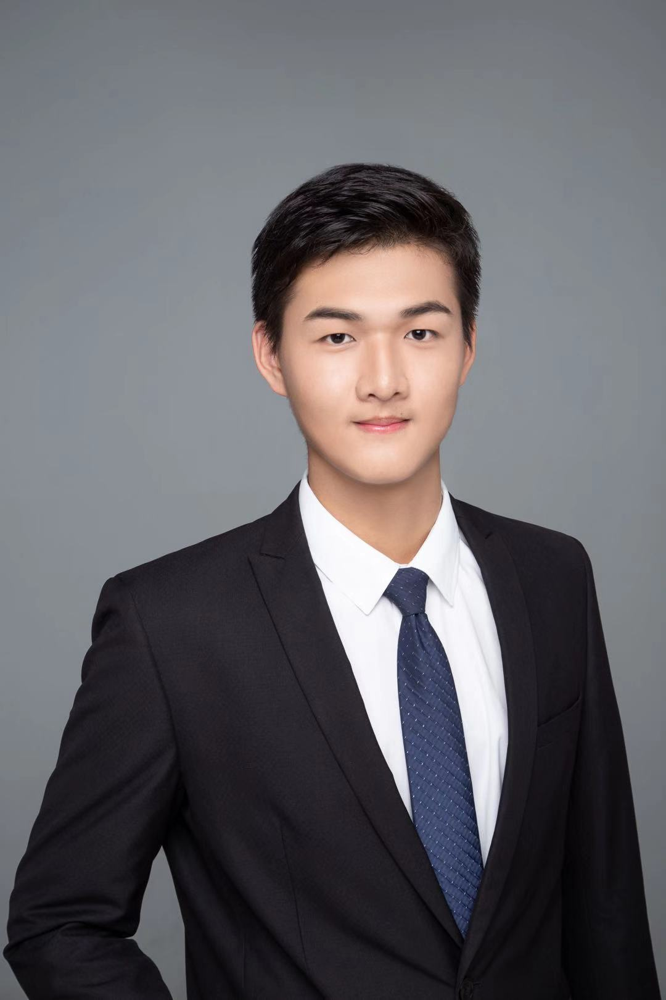{align=right width="170"}

**Name**: Tianyu Wu

**Title**: Interim Chair of Human Resources

**LinkedIn**: <https://www.linkedin.com/in/tianyu-henry-wu/>

 
 
 
 
 

!!! quote "Motto (Bilingual)"
    
    Earnest Executor, Frontier Explorer.

---

{align=right width="170"}

**Name**: Yixuan Li

**Title**: Interim Chair of Creativity

**LinkedIn**: <https://www.linkedin.com/in/yixuan-li-269356192/>

 
 

!!! quote "Motto (Bilingual)"
    
    Explore the possibility of combining design and technology to create beautiful and functional existences.

<!-- ---

{align=right width="170"}

**Name**: Yinhong (William) Zhao

**Title**: Interim Chair of Research Accelerator

**LinkedIn**: <https://www.linkedin.com/in/williamzhao123>

 
 
 
 

!!! quote "Motto (Bilingual)"
    
    Maximizing personal value-added to the world -->

---

{align=right width="170"}

**Name**: Ziliang (Lewis) Tian

**Title**: Interim Chair of Sustainability and Social Impact

**LinkedIn**: <https://www.linkedin.com/in/lewistian/>

 
 
 
 
 

!!! quote "Motto (Bilingual)"
    
    Technology & data evangelist, seeking the best version of self

---

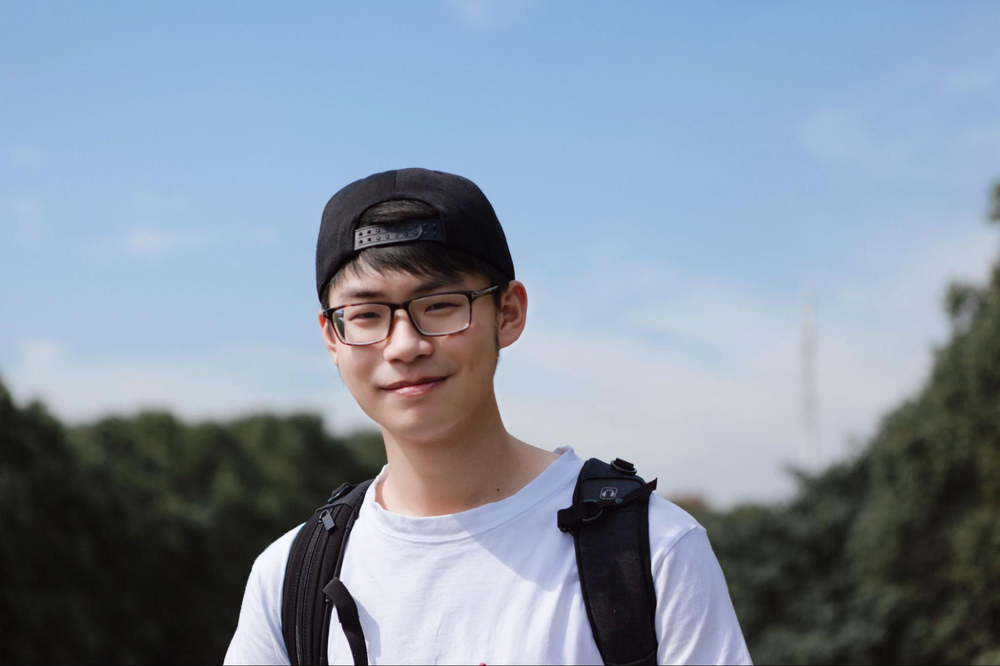{align=right width="170"}

**Name**: Zesen Zhuang

**Title**: Interim Chair of Technology Development

**LinkedIn**: <https://www.linkedin.com/in/zesen-zhuang-624591217/>

**Personal Website**: <https://crinstaniev.com>

 

!!! quote "Motto (Bilingual)"
    
    A tech geek who want to find out all the unknowns

---

{align=right width="170"}

**Name**: Zichao Chen

**Title**: Interim Co-Chair of SciEcon Lab Incubator

**LinkedIn**: <https://www.linkedin.com/in/zichao-9507281a9/>

 
 
 
 
 
 

!!! quote "Motto (Bilingual)"
    

---

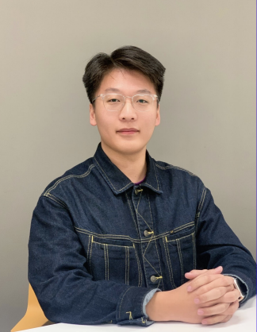{align=right width="170"}

**Name**: Yufan Zhang

**Title**: Interim Co-Chair of SciEcon Lab Incubator

**LinkedIn**: <https://www.linkedin.com/in/brucezzzzzzz/>

 
 
 
 

!!! quote "Motto (Bilingual)"
    
    

### SciEcon Program

#### SciEcon Afiiliates

---

{align=right width="170"}

**Name**: Jiasheng (Ray) Zhu

**Title**: Research Affiliate; Philanthropist Affiliate

**LinkedIn**: <https://www.linkedin.com/in/jiasheng-ray-zhu-845241177/>

 
 
 
 

---

{align=right width="170"}

**Name**: Xinyu (Michelle) Tian

**Title**: Research Affiliate; Philanthropist Affiliate

**LinkedIn**: <https://www.linkedin.com/in/xinyu-tian-1777aa203/>

 
 
 
 

---

{align=right width="170"}

**Name**: Tianyu Wu

**Title**: Research Affiliate; Philanthropist Affiliate

**LinkedIn**: <https://www.linkedin.com/in/tianyu-henry-wu/>

 
 
 
 
 

---

{align=right width="170"}

**Name**: Yinhong (William) Zhao

**Title**: Philanthropist Affiliate

**LinkedIn**: <https://www.linkedin.com/in/williamzhao123>

 
 
 
 

---

{align=right width="170"}

**Name**: Ziliang (Lewis) Tian

**Title**: Research Affiliate; Philanthropist Affiliate

**LinkedIn**: <https://www.linkedin.com/in/lewistian/>

 
 
 
 
 

---

{align=right width="170"}

**Name**: Yixuan Li

**Title**: Philanthropist Affiliate

**LinkedIn**: <https://www.linkedin.com/in/yixuan-li-269356192/>

 
 

---

{align=right width="170"}

**Name**: Zesen Zhuang

**Title**: Research Affiliate; Innovation Affiliate; Philanthropist Affiliate

**LinkedIn**: <https://www.linkedin.com/in/zesen-zhuang-624591217/>

 

---

{align=right width="170"}

**Name**: Zichao Chen

**Title**: Research Affiliate; Philanthropist Affiliate

**LinkedIn**: <https://www.linkedin.com/in/zichao-9507281a9/>

 
 
 
 
 

---

{align=right width="170"}

**Name**: Yufan Zhang

**Title**: Research Affiliate; Philanthropist Affiliate

**LinkedIn**: <https://www.linkedin.com/in/brucezzzzzzz/>

 
 
 
 

---

{align=right width="170"}

**Name**: Jiarui Zhang

**Title**: Research Affiliate

**LinkedIn**: <https://www.linkedin.com/in/jerry-zhang-b31b681bb/>

 
 

---

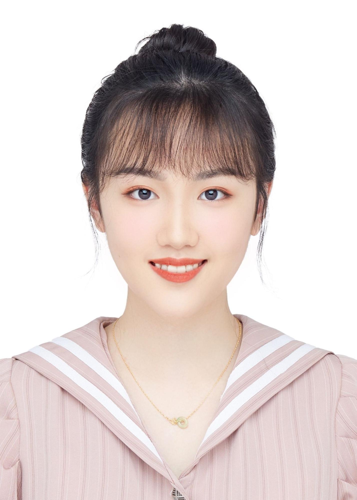{align=right width="170"}

**Name**: Jingxi Cui

**Title**: Research Affiliate

**LinkedIn**: <https://www.linkedin.com/in/jingxi-cui-b1bb641b3/>

 
 
 
 
 

---

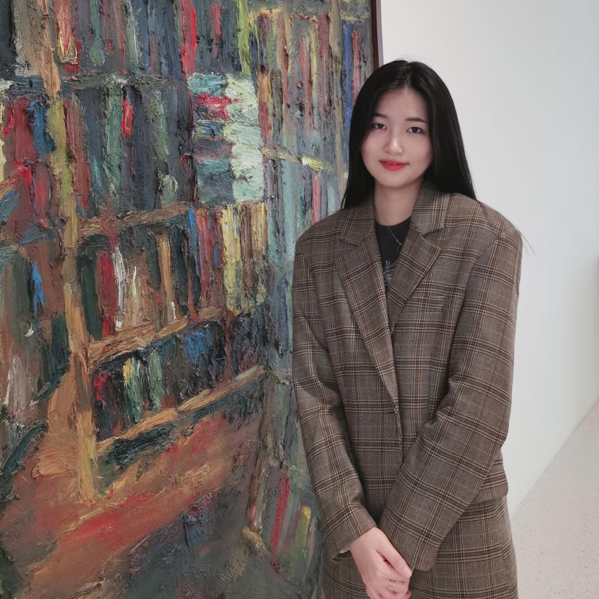{align=right width="170"}

**Name**: Zhiyi Chen

**Title**: Research Affiliate

**LinkedIn**: <https://www.linkedin.com/in/zhiyi-chen-527217201/>

 
 

---

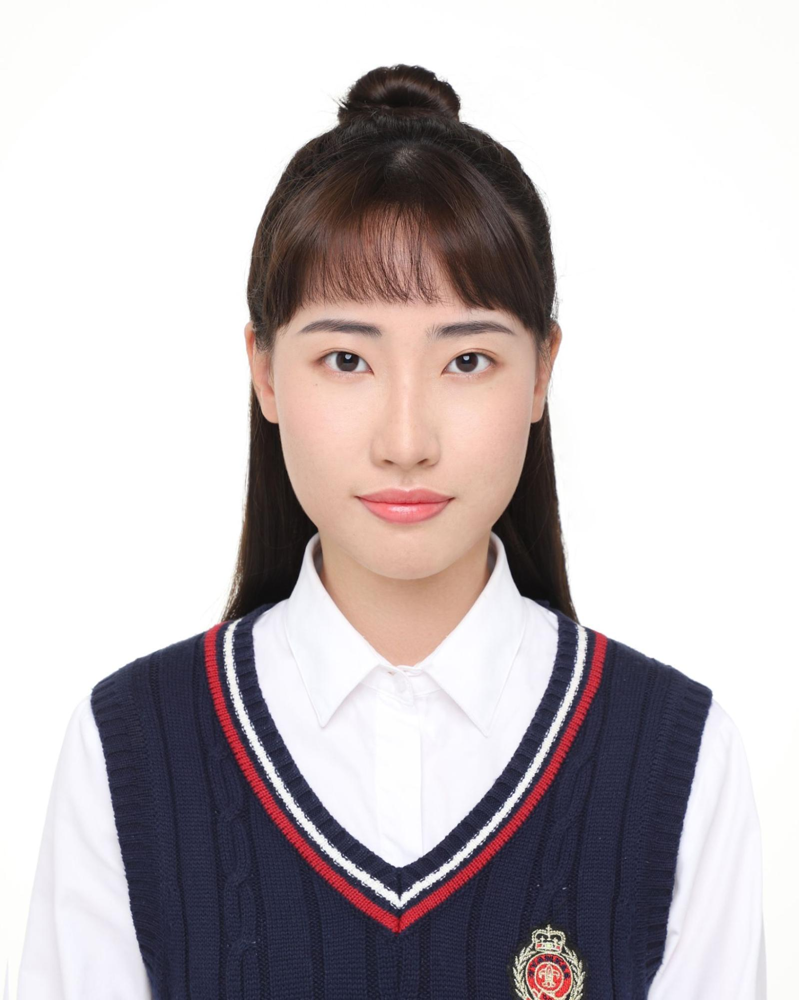{align=right width="170"}

**Name**: Fei Wu

**Title**: Research Affiliate

**LinkedIn**: <https://www.linkedin.com/in/feiwucara/>

 
 
 
 

---

{align=right width="170"}

**Name**: Saad Lahrichi

**Title**: Research Affiliate

**LinkedIn**: <https://www.linkedin.com/in/saadlahrichi/>

 
 
 
 
 

---

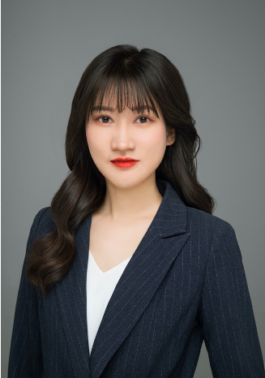{align=right width="170"}

**Name**: Jiayi Li

**Title**: Research Affiliate

**LinkedIn**: <https://www.linkedin.com/in/jiayi-li-188a27193/>

 
 
 
 
 

---

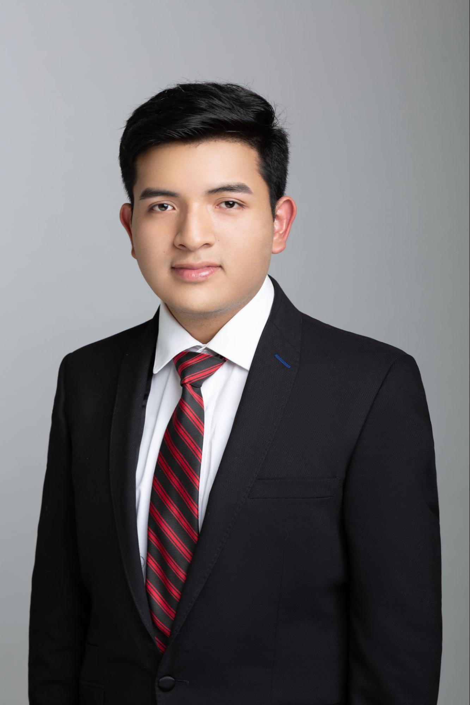{align=right width="170"}

**Name**: Carlos Gustavo Salas Flores

**Title**: Research Affiliate

**LinkedIn**: <https://www.linkedin.com/in/carlosgustavosalas/>

 
 
 
 
 

---

{align=right width="170"}

**Name**: Jingwei Li

**Title**: Innovation Affiliate

**LinkedIn**: <https://www.linkedin.com/in/jw-li/>

 
 

---

{align=right width="170"}

**Name**: Chenyu Wang

**Title**: Innovation Affiliate

**LinkedIn**: <https://www.linkedin.com/in/chenyuwangcw/>

 
 

---

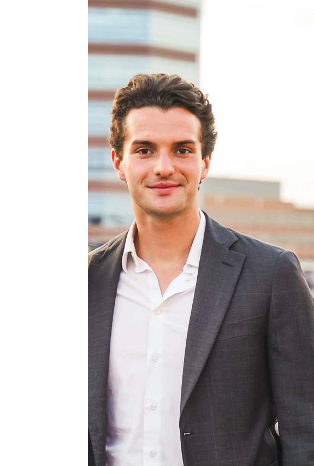{align=right width="170"}

**Name**: Francesco Cavallero

**Title**: Philanthropist Affiliate

**LinkedIn**: <https://www.linkedin.com/in/francesco-cavallero-180525172/ >

 
 
 
 
 

---

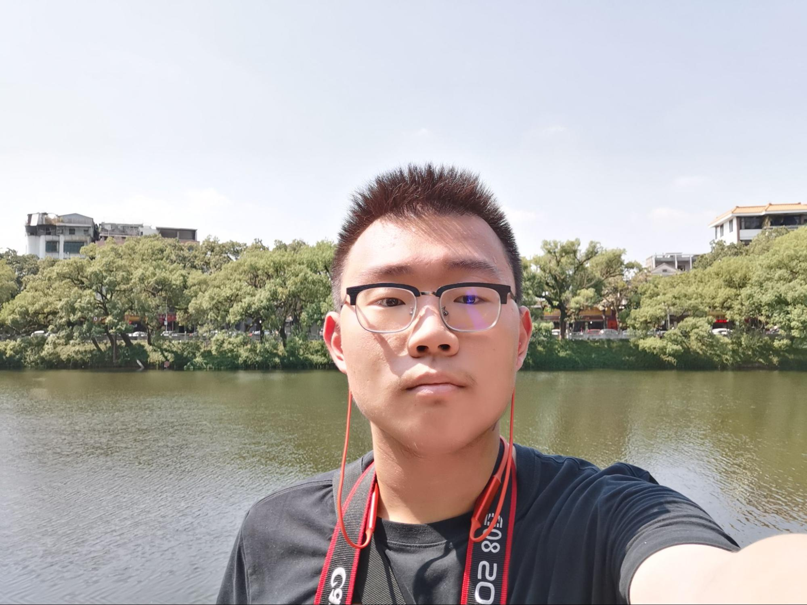{align=right width="170"}

**Name**: Lunji Zhu

**Title**: Philanthropist Affiliate

**LinkedIn**: [https://www.linkedin.com/in/francesco-cavallero-180525172/](https://www.linkedin.com/in/%E4%BC%A6%E7%A8%B7-%E6%9C%B1-831096192/)

 

---

{align=right width="170"}

**Name**: Zhitong Chen

**Title**: Philanthropist Affiliate

**LinkedIn**: [https://www.linkedin.com/in/zhitong-chen-9004591a2/](https://www.linkedin.com/in/zhitong-chen-9004591a2/)

 
 
 
 
 

---

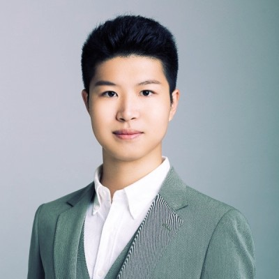{align=right width="170"}

**Name**: Haoxin Yu

**Title**: Philanthropist Affiliate

**LinkedIn**: <https://www.linkedin.com/in/haoxin-yu-424a27176/>

 
 
 

---

#### SciEcon AMA Distinguished Scholar

## SciEcon for Sustainability

As humanity faces unprecedented challenges such as climate change and a global pandemic, sustainability has become an indispensable endeavor for a better future. At SciEcon, sustainability has been a key focus since SciEcon's foundation. SciEcon strongly endorses projects that are shaping a sustainable world. We demonstrate our commitment to sustainability through interdisciplinary research including sustainable finance, ESG investment, carbon neutrality & carbon market, blockchain governance, risk management, and education for an integrated talent, etc.

### SciEcon in Actions

The pursuit of sustainability is a joint endeavor and SciEcon is a part of it. As countries and companies all over the world pledge to achieve carbon neutrality, a think tank said the UN's 2050 aim to decarbonize the world was a "mission possible." SciEcon is also actively contributing to sustainability through actions in research, innovation, and leadership. Besides endorsing [research](https://medium.com/sciecon-research) projects, we foster sparks of innovation regardless of its format, from developing software to hosting seminars. For instance, to enlighten more talents, SciEcon launched the AMA (Ask Me Anything) series where aspiring scholars of SciEcon interviewed experts on topics at the forefront of their fields. These interviews are published on [Medium](https://medium.com/sciecon-ama) as our open education resources and shared with a broader audience.

### How to Support Us

As SciEcon continues to innovate, your support can help fuel our research, innovation, and leadership. If you would like to support us, please fill the contact form below. You can choose to either make a donation or sponsor one of our events. In turn, we will show our gratitude by offering benefits and inviting you to be part of SciEcon’s history!

We invite you to a spacetime of the community, for the community, by the community. Let’s together contribute to the advancement of human civilizations! Join us and support us in any possible ways including but not limited to partnership, sposorship. We welcome and encourage any well-motivated crazy ideas. We are in this, all together!

### Learn more about sustainability

- [Global Program on Sustainability](https://www.worldbank.org/en/programs/global-program-on-sustainability)
- [ESG Research From MSCI](https://www.msci.com/research/esg-research)
- [UN PRI](https://www.unpri.org/)
- [IPCC - The Intergovernmental Panel on Climate Change](https://www.ipcc.ch/)

