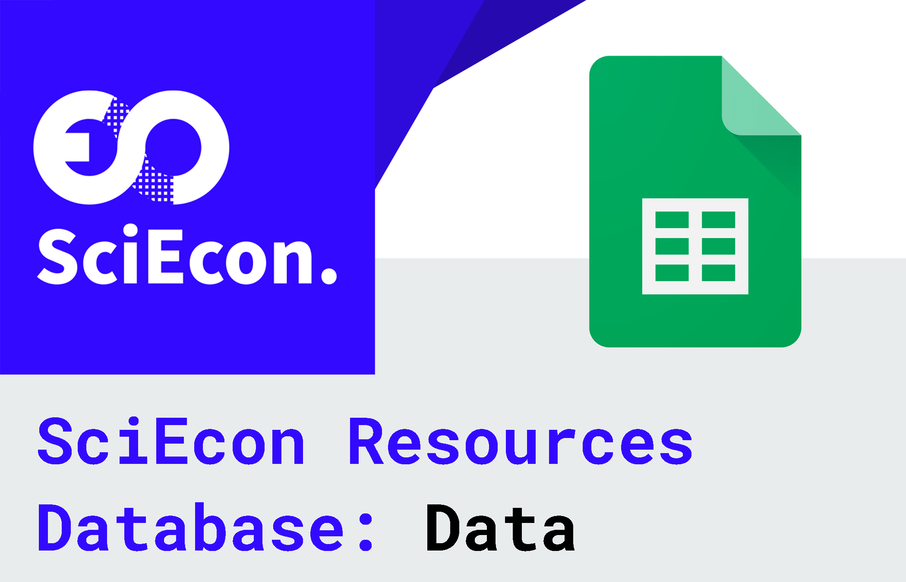
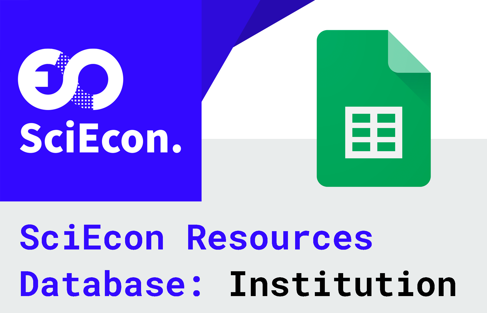
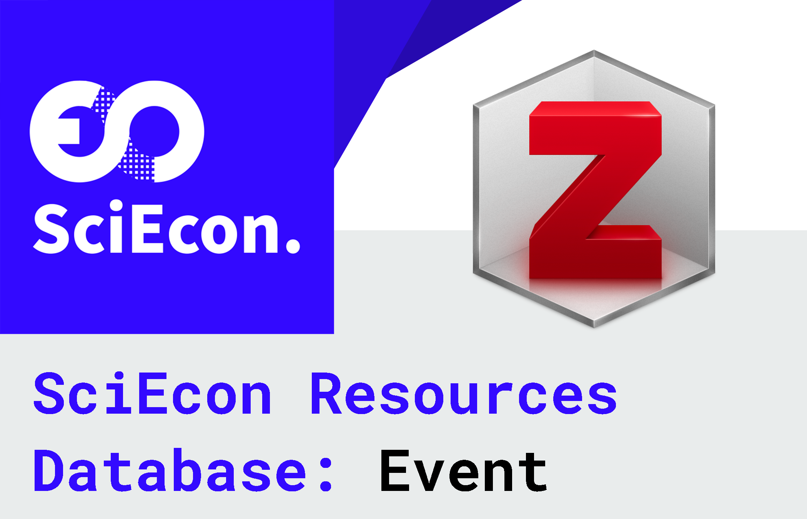
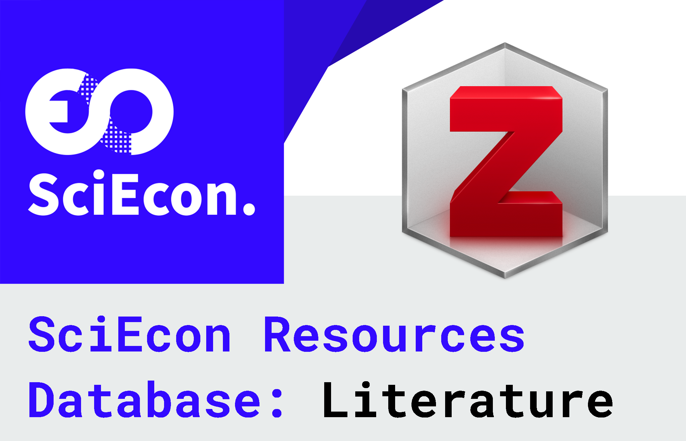
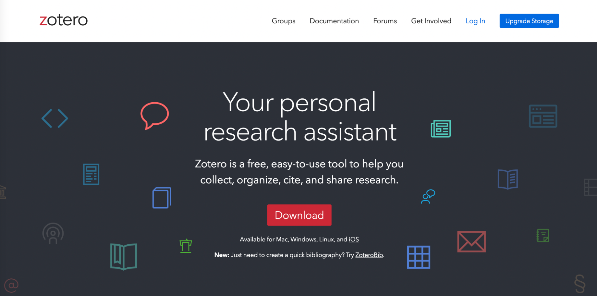
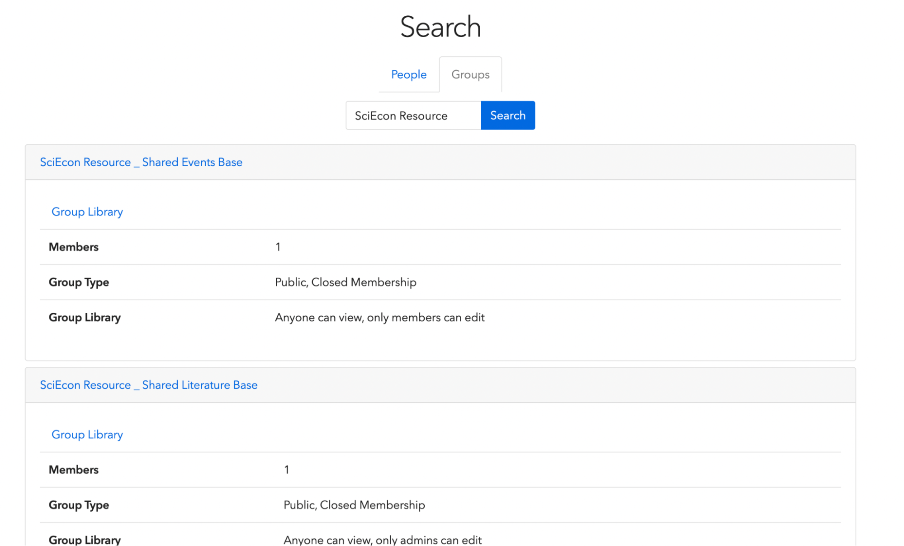

# Resource

## Introduction

SciEcon Resources is to collect and share useful research and innovate resources, not only for reference and use within SciEcon but also for communication and sharing with all researchers and industry experts. Both the members at SciEcon CIC and also the public audience can share, upload, and use the recourses in SciEcon Resources Database. SciEcon E-Board is responsible to review and approve the newly added content in the database on a regular basis.

## Open Education Resources (OER)

SciEcon aims at creating open education resources (OER) of the community, by the community, for the community. Our founding president Prof. Luyao Zhang has been leading an Industry 4.0 Open Education Publication Initiative that calls for collaborations among university faculties, students, staffs, and beyond to create multi-media (OER) that serves the digital transformation of education in Industry 4.0. Since now, three collections have been created:

- **Series No. 1 Innovate on the Internate Computer**: [https://ic.pubpub.org/](https://ic.pubpub.org/)
- **Series No. 2 Intelligent Economics: An Explanable AI Approach**: [https://ie.pubpub.org/](https://ie.pubpub.org/)
- **Series No. 3 Computational Econnomics**: [https://ie.pubpub.org/](https://ie.pubpub.org/)

## Data

<figure markdown>
{ width="500" }
</figure>

Link to database:
<https://docs.google.com/spreadsheets/d/17ge03x7xJwAR-LPsib_jatLZrclvDtAu6CQql36nDMg/edit?usp=sharing>

Fill out the following Google Form to contribute to the database:
<https://docs.google.com/forms/d/e/1FAIpQLScd6yGFuuBN2fLaqmCVRaMQJAOlWb8UqOMA9ICd5qDcQjlRww/viewform?usp=sf_link>

## Institution

<figure markdown>
{ width="500" }
</figure>

Link to database:
<https://docs.google.com/spreadsheets/d/1XXhEruZF6pXcfoAwmDsiQ42qS-mgMdfPOZzxIuouw54/edit?usp=sharing>

Fill out the following Google Form to contribute to the database:
<https://docs.google.com/forms/d/e/1FAIpQLSebkBFMB9dDJbQ4od7iuFVWPm1yqJyklT38FCZHkkMDfD9Pfw/viewform?usp=sf_link>

## Event

<figure markdown>
{ width="500" }
</figure>

## Literature

<figure markdown>
{ width="500" }
</figure>

## User guide for public audiences

You are welcome to check out the Event list in our resource library. Here are a few steps for you to view our shared group in a public way. You may need to prepare your browser, and go to the Zotero official website.

**Step 1: Access the website**

<figure markdown>
{ width="500" }
</figure>

Search for Zotero on your browser or go to [https://www.zotero.org/](https://www.zotero.org/) to access the official Zotero website

**Step 2: Search for groups**

<figure markdown>
{ width="500" }
</figure>

Log in / sign up a Zotero account and then click the “Groups” to search for our shared resource base. Then search for “**SciEcon Resource**” and then you will see the two shared resource groups. Then by clicking the resource library that you want, you will see the event list.

[Back to Home](./index.md){ .md-button .md-button--primary }